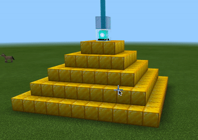
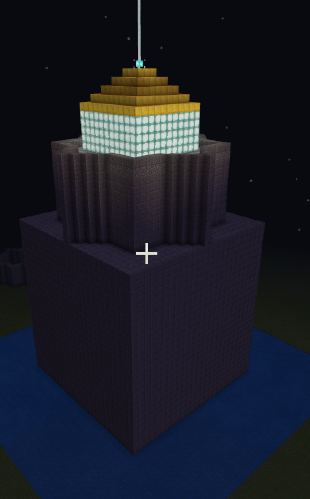

# Александрійський маяк

#### Опис


Ми продовжуємо нашу подорож по Стародавній Греції, але сьогодні вона буде особливою. Адже ми побудуємо одне з див світу — ОАександрійський (Фароській) маяк🗺


## Згадаймо🤔

1. Що таке роза вітрів?&#x20;
2. Зі скількох різних напрямків дмув вітер на думку древніх греків?
3. Як побудувати розу вітрів вгору (у висоту)?&#x20;

## Сьогодні ми:

1. Згадаємо будівництво елементів: море, острів, куб, роза вітрів (об'єднаємо їх в одне ціле)&#x20;
2. Побудуємо піраміду з маяком&#x20;
3. Побудуємо див світу — Александрійський маяк

> **Усі ці навички обов'язково знадобляться під час виконання вашого проєкту!**😉

## Основні завдання


Сьогодні ми з вами опинилися на острові Фарос, що розташований біля узбережжя міста Александрія, який розкинувся на території Єгипту. На той період часу ця територія була частиною Стародавньої Греції.&#x20;

Александрія названа на честь знаменитого полководця Александра Македонського. У його плани входило перетворити місто в солідний торговий центр, адже воно вдало розташовувалось на перетині наземних, річкових і морських шляхів сполучення декількох материків.&#x20;

Острів Фарос став гаванню, що приймає торгові кораблі, але через одноманітність ландшафту узбережжя моряки потребували додаткового **орієнтиру,** і їх цілком би влаштував сигнальний вогонь, що висвітлює місце входу в гавань.


### Піраміда

У Майнкрафті є можливість побудувати піраміду та маяк зверху.

| **№**         | **1**                                                                                                                                                                                                                                                                                                                                                                                                                                                                                                                                                                                                                        |
| ------------- | ---------------------------------------------------------------------------------------------------------------------------------------------------------------------------------------------------------------------------------------------------------------------------------------------------------------------------------------------------------------------------------------------------------------------------------------------------------------------------------------------------------------------------------------------------------------------------------------------------------------------------- |
| **Завдання**  | <ol><li>Побудувати піраміду з золотих блоків з центром в точці <strong>(0;4;0),</strong> шириною основи <strong>в 11 блоків</strong> та висотою <strong>в 5 блоків</strong>, нагорі піраміди поставити маяк</li><li>Побудувати піраміду з алмазних блоків із центром в точці <strong>(0;4;20),</strong> шириною основи <strong>в 9 блоків</strong> та висотою в <strong>4 блоки</strong>, нагорі піраміди поставити маяк</li><li>Побудувати піраміду з центром в точці <strong>(20;4;0),</strong> шириною основи <strong>в 7 блоків</strong> та висотою <strong>в 3 блоки</strong>, нагорі піраміди поставити маяк</li></ol> |
| **Код**       | 
 
                                                                                                                                                                                                                                                                                                                                                                                                                                                                                                                |
| **Результат** | .png>)                                                                                                                                                                                                                                                                                                                                                                                                                                                                                                                                                                                        |

### Магія від маяка

Маяки в Майнкрафті дозволяють використовувати магію. Для цього треба натиснити правою клавішею миші на сам маяк та надати золотий злиток/алмаз/ізумруд в обмін на початок дії певного магічного впливу (сила, швидкіть, стрибок, тощо).

| .png>)  |
| -------------------------------------- |
| .png>) |
| .png>) |
| .png>) |
| .png>) |

### Очищення створених об'єктів

Для того, щоб очистити об'єкт, необхідно замість його блоків розмістити блоки повітря.

| **№**         | **2**                                                                                                           |
| ------------- | --------------------------------------------------------------------------------------------------------------- |
| **Завдання**  | <ol><li>Замініть блоки збудованої піраміди блоками повітря</li></ol>                                            |
| **Код**       | 
 
 |
| **Результат** |                                                                                 |

### Використання циклу

При побудові піраміди ми використовуємо однакові блоки й можемо спостерігати тенденцію в зміні координат:

.png>)

Для того, щоб значно скоротити кількість блоків, які ми використовуємо, додамо до конструкції цикл. **Цикл із параметром** повторюється **5 разів,** і на кожному кроці виконання циклу значення лічильника змінюється **від 0 до 4** (0,1,2,3,4).

| Код                                    | Результат                              |
| -------------------------------------- | -------------------------------------- |
| .png>) | .png>) |

Тепер створимо та вирахуємо змінну **i**, що буде залежати від змінної-лічильника **index**.

| Код                                    | Результат                              |
| -------------------------------------- | -------------------------------------- |
| .png>) | .png>) |

В результаті — зробимо такі самі **піраміди**, тільки із використанням циклів:

| **№**         | **3**                                                                                                                                                                                                                                                                                                                                                                                                                                                                                                                                                                                                                                                                                                           |
| ------------- | --------------------------------------------------------------------------------------------------------------------------------------------------------------------------------------------------------------------------------------------------------------------------------------------------------------------------------------------------------------------------------------------------------------------------------------------------------------------------------------------------------------------------------------------------------------------------------------------------------------------------------------------------------------------------------------------------------------- |
| **Завдання**  | <ol><li>Використовуючи цикли, побудувати піраміду з золотих блоків з центром в точці <strong>(0;4;0),</strong> шириною основи <strong>в 11 блоків</strong> та висотою <strong>в 4 блоки</strong>, зверху такої піраміди поставити маяк</li><li>Використовуючи цикли, побудувати піраміду з алмазних блоків з центром в точці <strong>(0;4;20),</strong> шириною основи <strong>в 9 блоків</strong> та висотою <strong>в 3 блоки,</strong> зверху такої піраміди поставити маяк</li><li>Використовуючи цикли, побудувати піраміду з центром в точці <strong>(20;4;0),</strong> шириною основи <strong>в 7 блоків</strong> та висотою <strong>в 2 блоки</strong>, зверху такої піраміди поставити маяк.</li></ol> |
| **Код**       | .png>)                                                                                                                                                                                                                                                                                                                                                                                                                                                                                                                                                                                                                                                                          |
| **Результат** | .png>)                                                                                                                                                                                                                                                                                                                                                                                                                                                                                                                                                                                                                                                                          |

### Основа маяка


**Будівництво маяка почалося в 285 році до н.е., а всі роботи керувалися архітектором Состратом Кнідським**. Бажаючи увійти в історію, Сострат на мармуровій стіні маяка висік надпис, у якому засвідчив, що саме він зводить цю конструкцію заради мореплавців. Потім чоловік сховав її під шар штукатурки, а на ній вже прославив царя Птолемея. Однак долі було завгодно, щоб людство дізналося ім'я майстра — поступово штукатурка відвалилася і розкрила таємницю великого інженера.&#x20;

Фароська споруда, призначена для освітлення гавані, **мала три яруси**, перший з яких був **представлений квадратом** зі сторонами по 30,5 м. Усі чотири грані нижнього квадратного ярусу були звернені до всіх сторін світу. У висоту він досягав 60 м, а його кути прикрашали статуї тритонів. Призначенням цього приміщення було розміщення робітників і охоронців, а також облаштування комор для зберігання запасів провізії і палива.


Піднімемо наш маяк над землею та поставимо його на постамент з морських ліхтарів:

| Код                                    | Результат                              |
| -------------------------------------- | -------------------------------------- |
| .png>) | .png>) |

### Піраміда на основі

| **№**         | **4**                                                                                                                                                                                                                                                                                                                                                                                                                                                                                                                                                                                                                                                                                                                                                                                                                                                                                                            |
| ------------- | ---------------------------------------------------------------------------------------------------------------------------------------------------------------------------------------------------------------------------------------------------------------------------------------------------------------------------------------------------------------------------------------------------------------------------------------------------------------------------------------------------------------------------------------------------------------------------------------------------------------------------------------------------------------------------------------------------------------------------------------------------------------------------------------------------------------------------------------------------------------------------------------------------------------- |
| **Завдання**  | <ol><li>Використовуючи цикли, побудувати піраміду з золотих блоків з центром в точці <strong>(0;10;0),</strong> шириною основи <strong>в 11 блоків</strong> та висотою <strong>в 5 блоків</strong>, зверху такої піраміди поставити маяк. Під піраміду поставити блоки 11х11 та висотою 6 блоків з морських ліхтарів.</li><li>Використовуючи цикли, побудувати піраміду з алмазних блоків з центром в точці <strong>(0;4;20),</strong> шириною основи в <strong>9 блоків</strong> та висотою <strong>в 4 блоки</strong>, зверху такої піраміди поставити маяк. Під піраміду поставити блоки 9х9 та висотою 5 блоків з морських ліхтарів.</li><li>Використовуючи цикли, побудувати піраміду з центром в точці <strong>(20;4;0),</strong> шириною основи в 7 блоків та висотою в 3 блоки, зверху такої піраміди поставити маяк. Під піраміду поставити блоки 7х7 та висотою 4 блоки з морських ліхтарів.</li></ol> |
| **Код**       | .png>)                                                                                                                                                                                                                                                                                                                                                                                                                                                                                                                                                                                                                                                                                                                                                                                                                                                                           |
| **Результат** | .png>)                                                                                                                                                                                                                                                                                                                                                                                                                                                                                                                                                                                                                                                                                                                                                                                                                                                                           |


Середній ярус Александрійського маяка був побудований у вигляді **восьмикутника**, грані якого орієнтувалися на напрямки вітрів. Верхня частина цього ярусу декорувалася статуями, а деякі з них були флюгерами.&#x20;

Третій ярус, виконаний у формі циліндра, був ліхтарем. Його обнесли 8 колонами і накрили їх куполом-конусом. А на його верхівку поставили 7-метрову статую Ісіди-Фарії, що вважалася захисницею мореплавців (деякі джерела стверджують, що це була скульптура Посейдона — царя морів). Завдяки складності системи металевих дзеркал, світло вогню, запаленого на вершині маяка, посилювався, і охоронці вели спостереження за морським простором.

Ми з вами трохи ускладнимо завдання і останній ярус у нас буде пірамідою


### Функції

#### Функція без параметрів 

Для того, щоб використовувати декілька елементів в рамках певного цілого, зручно використовувати такий інструмент, як функції.

Для цього можемо створити функцію в меню «Функції».

.png>)

Найпростіший варіант функції, тільки із назвою:

.png>)

Для того, щоб функція запускала код, необхідно додати його **в середину блоку функції**.

.png>)

Для використання необхідно взяти блок функції та перетягнути в те місце, де ви бажаєте запустити відповідну функцію.

.png>)

#### Функція із параметром

Більш складний варіант — це використання **параметрів**. Коли ми можемо передавати до функції певні параметри (у нашому прикладі із Александрійським маяком — рівень, на якому починається кожен елемент).

.png>)

Тоді змінні-параметри можна використовувати в середині функції.

.png>)

### Маяк


Висота маяка становила близько **120-150 метрів**, протягом багатьох століть це була одна з найвищих штучних споруд у світі.&#x20;

Через майже тисячу років від побудови, маяк Александрії все ж почав руйнуватися. Сталося це в 796 році н.е. через потужний землетрус — верхня частина конструкції просто звалилася. Від величезного 120-метрового маяка залишилися лише руїни, але і ті досягали у висоту близько 30 м. Дещо пізніше уламки маяка стали в нагоді для зведення військового форту, який неодноразово перебудовувався.&#x20;

Єгиптяни планують провести роботи з відтворення втраченого дива світу, але ми з вами вже зараз можемо спробувати його відтворити самостійно.


Поєднаємо всі елементи маяка в одному коді за допомогою функцій:

### Море

.png>)

### Основна будівля

.png>)

### Напрямки сторін світу (компас)

.png>)

### Роза вітрів

.png>)

.png>)

.png>)

.png>)

### Майданчик-рівень

.png>)

### Піраміда із ліхтарем

.png>)

### Виклик всіх блоків разом

.png>)

### Результат

## Творчі завдання

1. Змініть пропорції маяка (так, щоб, наприклад, базова частина була не 20, а 25 блоків; роза вітрів — 15 блоків, тощо).&#x20;
2. Додайте до острова, на якому стоїть маяк, піщане узбережжя.&#x20;
3. Побудуйте на узбережжі причал, до якого зручно підпливти на човні.&#x20;
4. У маяку додайте двері, та зробіть внутрішнє оснащення (на власний розсуд). Прикрасьте маяк ззовні.

## Супертворчi завдання

1. Зробіть відеоогляд отриманого маяка, спираючись на історичні відомості, до яких можна додати дещо фантазії та пригод.&#x20;
2. **Відеоогляд** залийте на власний YouTube, а в коментарях додайте посилання на ваш код та посилання на файли світу (попередньо завантаживши файли світу в документи на Google.Drive).


На наступному занятті ми продовжимо подорож Стародавнім світом, але куди саме ми вирушимо — дізнаєтеся далі. Також ви отримаєте навички, які стануть у нагоді під час виконання вашого проєкту😉

